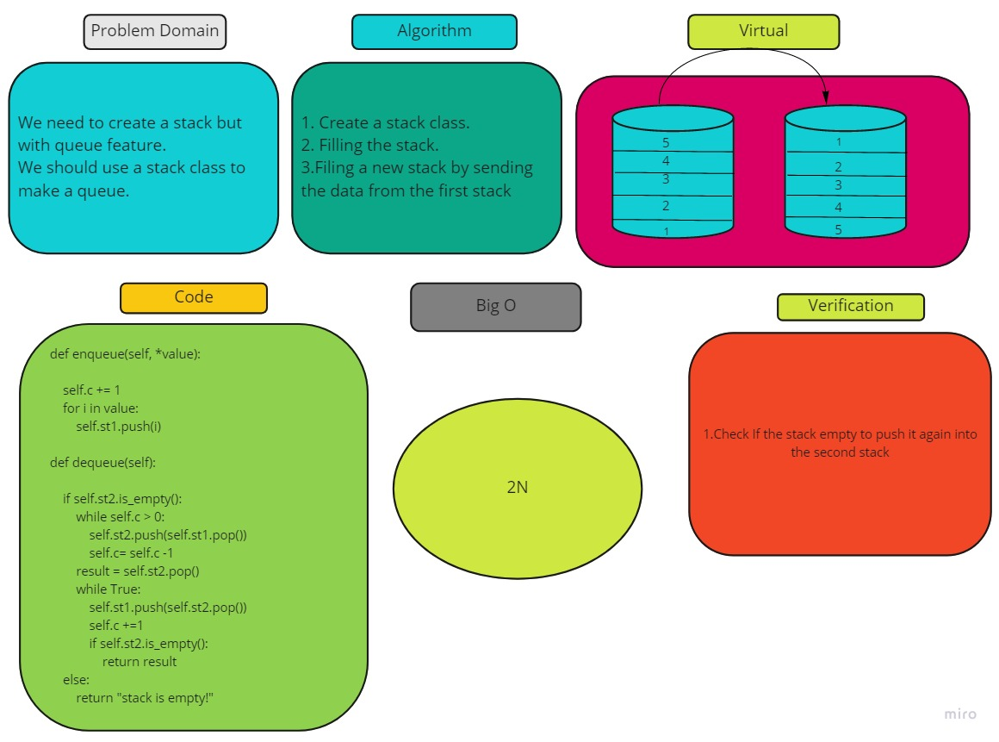

# Challenge Summary
<!-- Description of the challenge -->
Create a brand new PseudoQueue class. Do not use an existing Queue. Instead, this PseudoQueue class will implement our standard queue interface (the two methods listed below), but will internally only utilize 2 Stack objects. Ensure that you create your class with the following methods

## Whiteboard Process
<!-- Embedded whiteboard image -->

## Approach & Efficiency
<!-- What approach did you take? Why? What is the Big O space/time for this approach? -->
I creat a stack and the push its value into another stack. to take the queue feature 

## Solution
<!-- Show how to run your code, and examples of it in action -->
1. Create stack a new.
2. dequeue from the first stack into the other stack to flip the arane of the data.