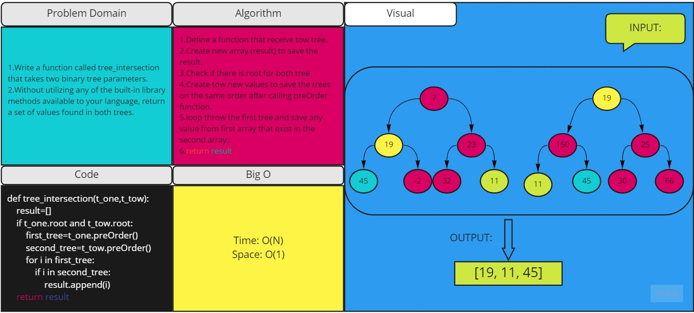

# Challenge Summary
<!-- Description of the challenge -->
1.Write a function called tree_intersection that takes two binary tree parameters.
2.Without utilizing any of the built-in library methods available to your language, return a set of values found in both trees.

## Whiteboard Process
<!-- Embedded whiteboard image -->

## Approach & Efficiency
<!-- What approach did you take? Why? What is the Big O space/time for this approach? -->
Time: O(N)
Space: O(1)
## Solution
<!-- Show how to run your code, and examples of it in action -->
1.Define a function that receive tow tree.
2.Create new array (result) to save the result.
3.Check if there is root for both tree
4.Create tow new values to save the trees on the same order after calling preOrder function.
5.loop throw the first tree and save any value from first array that exist in the second array.
6.return result 