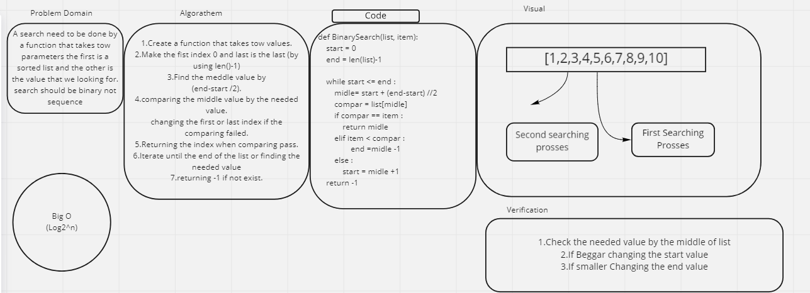

Challenge Summary
There is a sorted list that we should search over. 
we should do a binary search not sequence 

Challenge
We should start with the middle index , return the index if match else we divide the even to the right or the left regarding to the item if it larger or less than the middle index 
Approach & Efficiency
Big O :
log 2^n
Solution
