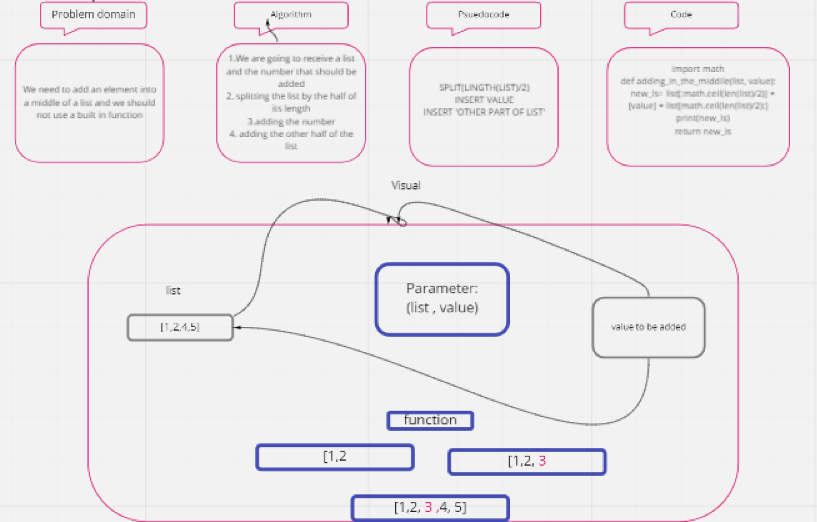

# Challenge Summary
<!-- Short summary or background information -->
We need to add an element into a middle of a list and we should not use a built in function
## Challenge Description
<!-- Description of the challenge -->
We need to add an element into a middle of a list and we should not use a built in function
## Approach & Efficiency
<!-- What approach did you take? Why? What is the Big O space/time for this approach? -->

## Solution
<!-- Embedded whiteboard image -->

