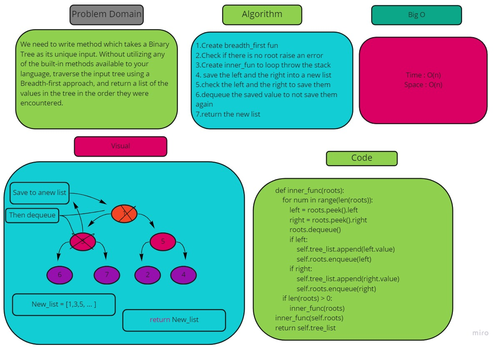

# Challenge Summary
<!-- Description of the challenge -->
Write a breadth first traversal method which takes a Binary Tree as its unique input. Without utilizing any of the built-in methods available to your language, traverse the input tree using a Breadth-first approach, and return a list of the values in the tree in the order they were encountered.
## Whiteboard Process
<!-- Embedded whiteboard image -->

## Approach & Efficiency
<!-- What approach did you take? Why? What is the Big O space/time for this approach? -->
Time : o(n)
Space : O(n)

## Solution
<!-- Show how to run your code, and examples of it in action -->
1.Create breadth_first fun

2.Check if there is no root raise an error

3.Create inner_fun to loop throw the stack

4. save the left and the right into a new list

5.check the left and the right to save them

6.dequeue the saved value to not save them again

7.return the new list