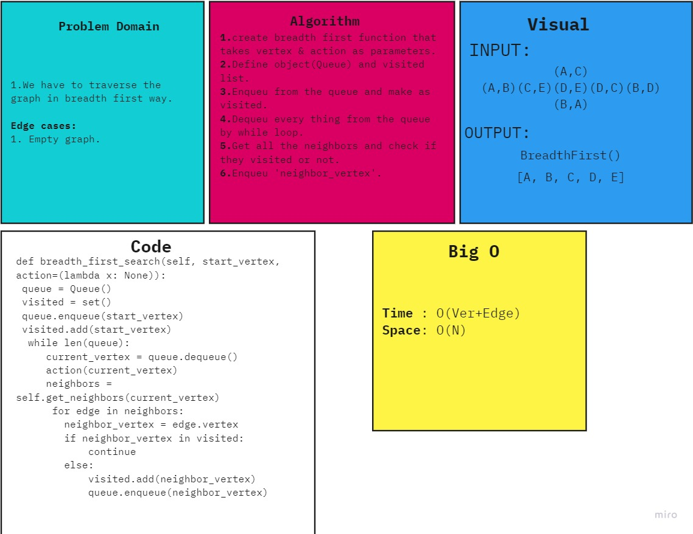

# Challenge Summary:
We have to retreave the data from the graph in breadth first way, 
## Whiteboard Process:

## Approach & Efficiency:
Time : O(Ver+Edge)
Space: O(N)
## Solution:
1.create breadth first function that takes vertex & action as parameters.
2.Define object(Queue) and visited list.
3.Enqueu from the queue and make as visited.
4.Dequeu every thing from the queue by while loop.
5.Get all the neighbors and check if they visited or not.
6.Enqueu 'neighbor_vertex'.
