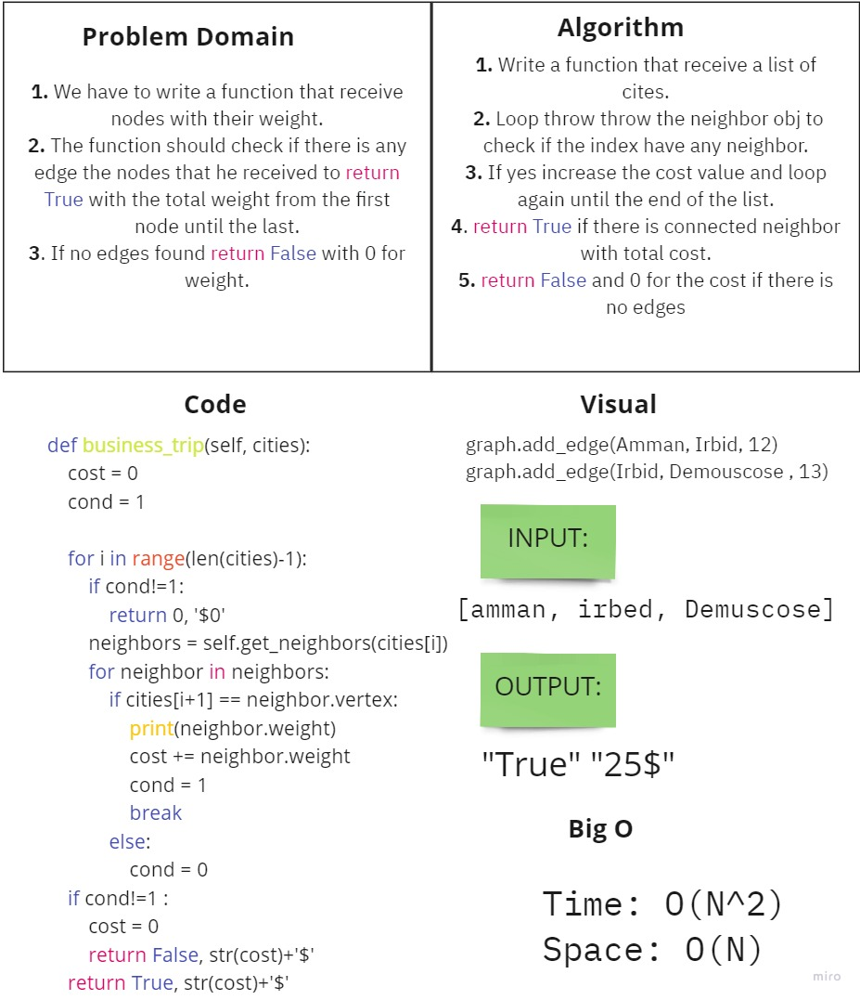

# Challenge Summary
<!-- Description of the challenge -->
We have to write a function that receive nodes with their weight. The function should check if there is any edge the nodes that he received to return True with the total weight from the first node until the last. If no edges found return False with 0 for weight.
## Whiteboard Process
<!-- Embedded whiteboard image -->

## Approach & Efficiency
<!-- What approach did you take? Why? What is the Big O space/time for this approach? -->
Time: O(N^2)
Space: O(N)
## Solution
<!-- Show how to run your code, and examples of it in action -->
1. Write a function that receive a list of cites.
2. Loop throw throw the neighbor obj to check if the index have any neighbor.
3. If yes increase the cost value and loop again until the end of the list.
4. return True if there is connected neighbor with total cost.
5. return False and 0 for the cost if there is no edges