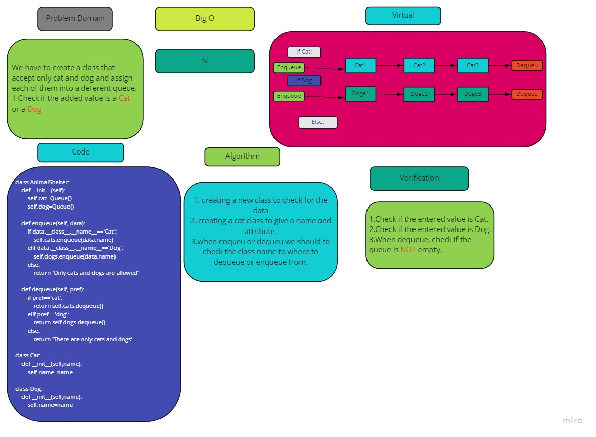

# Challenge Summary
<!-- Description of the challenge -->
Create a class called AnimalShelter which holds only dogs and cats. The shelter operates using a first-in, first-out approach.

## Whiteboard Process
<!-- Embedded whiteboard image -->

## Approach & Efficiency
<!-- What approach did you take? Why? What is the Big O space/time for this approach? -->
Adding a cat or dog by creating a calss for it  
check for the rare if exist or not and ad to it 
Big O is N
## Solution
<!-- Show how to run your code, and examples of it in action -->

Create a new tow classes and add by them to the queue ..
check if the added value is a dog or a cat it will push ,, if not it will cause an error. 
For dequeue we have to check if the queue is emety or not 
