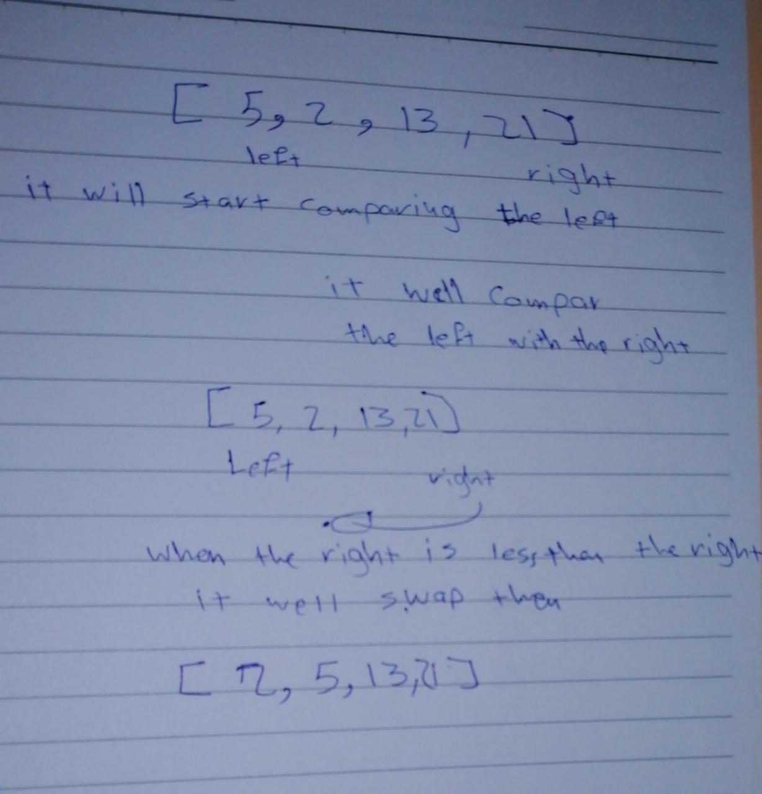

Define a function that receive array and right index and the last.
call a other function to swap  the first with the second by third function if it is smallest.
Repeat this step to make sure it is sorted

IT will compar starting from the left with the right. until it find smallest value and repalce it with the left... 
Then it change the left.