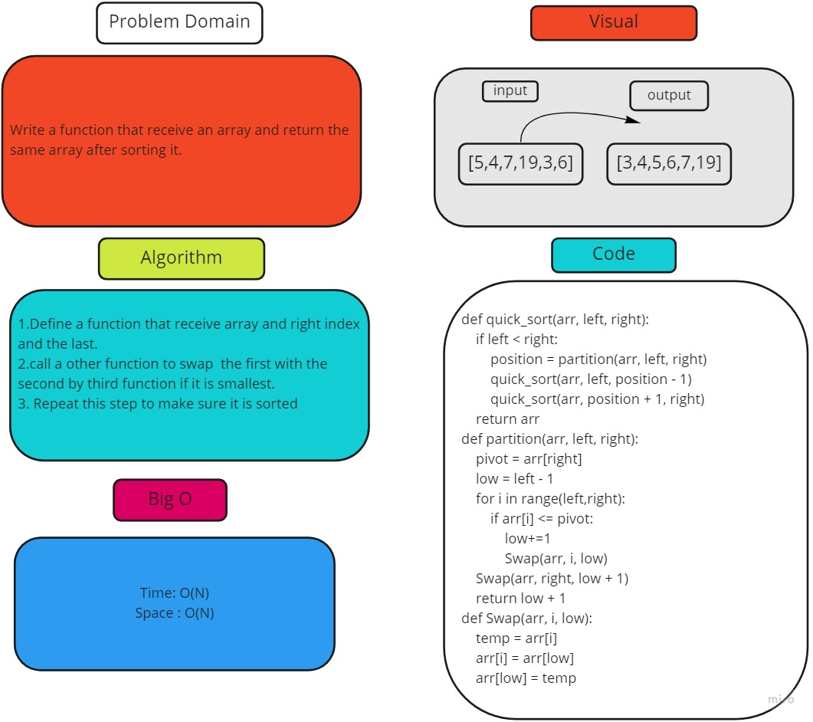

# Challenge Summary
<!-- Description of the challenge -->
Write a function that receive an array and return the same array after sorting it.
## Whiteboard Process
<!-- Embedded whiteboard image -->

## Approach & Efficiency
<!-- What approach did you take? Why? What is the Big O space/time for this approach? -->
Time: O(N)
Space : O(N)
## Solution
<!-- Show how to run your code, and examples of it in action -->

Define a function that receive array and right index and the last.
call a other function to swap  the first with the second by third function if it is smallest.
Repeat this step to make sure it is sorted
