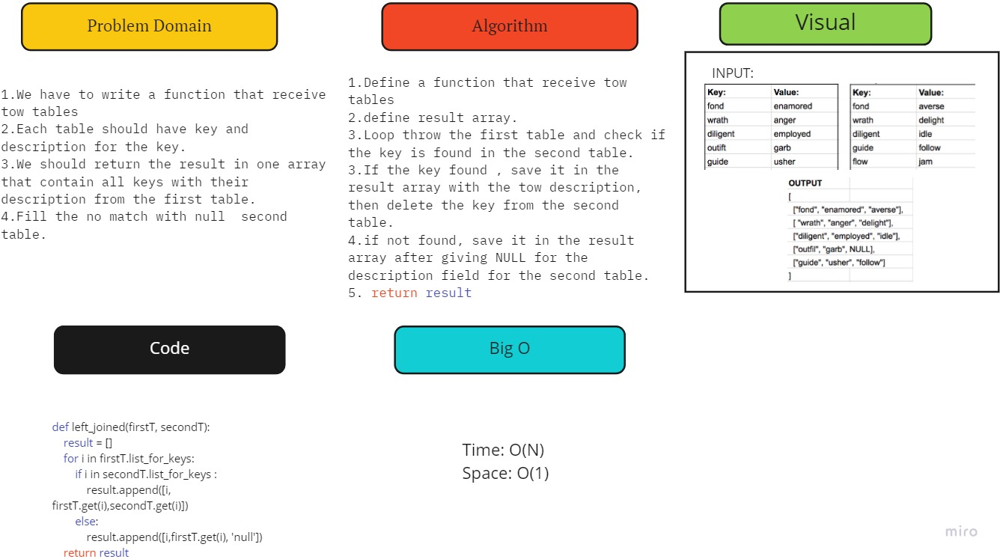

# Hashmap LEFT JOIN
We have to write a function that receive tow tables each table should have key and description for the key.
## Challenge
I should return the result in one array that contain all keys with their description from the first table.
Fill the no match with null  second table.
## Approach & Efficiency
Time: O(N)
Space: O(1)
## Solution

1.Define a function that receive tow tables
2.define result array.
3.Loop throw the first table and check if the key is found in the second table.
3.If the key found , save it in the result array with the tow description, then delete the key from the second table.
4.if not found, save it in the result array after giving NULL for the description field for the second table.
5. return result