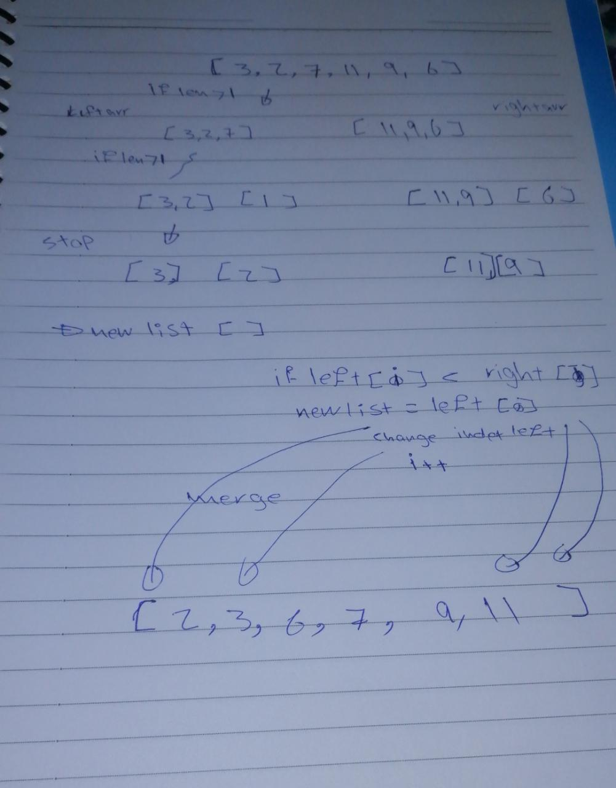

In the first function I split the array and call the function again and again to make single parts>>
then I send the new parts to merge function to connect and merge them to gather after comparing with all items>> Smaller comes first 
