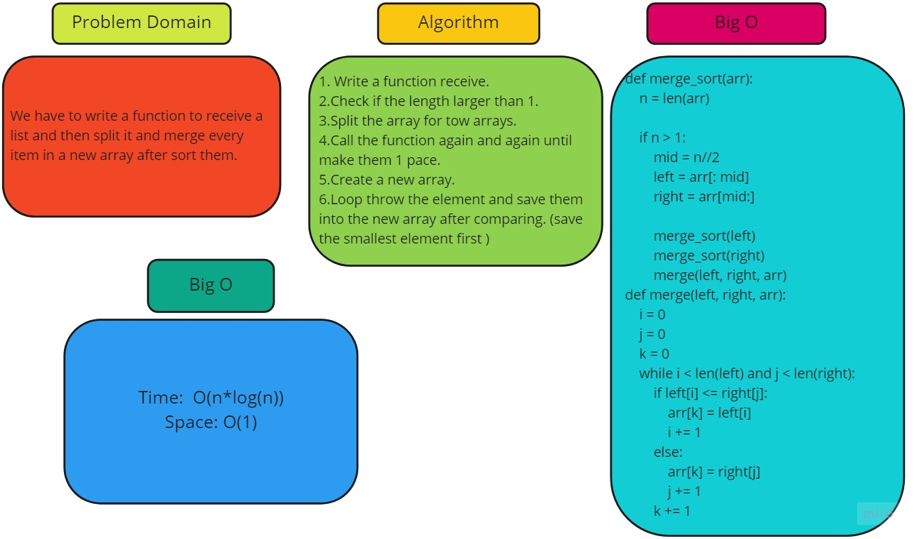

# Challenge Summary
<!-- Description of the challenge -->
We have to write a function to receive a list and then split it and merge every item in a new array after sort them.
## Whiteboard Process
<!-- Embedded whiteboard image -->

## Approach & Efficiency
<!-- What approach did you take? Why? What is the Big O space/time for this approach? -->
Time:  O(n*log(n))
Space: O(1)
## Solution
<!-- Show how to run your code, and examples of it in action -->
1. Write a function receive.
2.Check if the length larger than 1.
3.Split the array for tow arrays.
4.Call the function again and again until make them 1 pace.
5.Create a new array.
6.Loop throw the element and save them into the new array after comparing. (save the smallest element first )