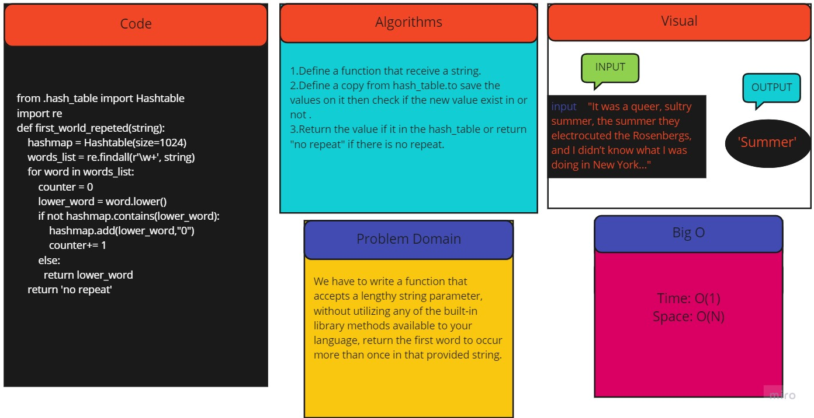

# Challenge Summary
<!-- Description of the challenge -->
We have to write a function that accepts a lengthy string parameter, without utilizing any of the built-in library methods available to your language, return the first word to occur more than once in that provided string.
## Whiteboard Process
<!-- Embedded whiteboard image -->

## Approach & Efficiency
<!-- What approach did you take? Why? What is the Big O space/time for this approach? -->
Time: O(1)
Space: O(N)
## Solution
<!-- Show how to run your code, and examples of it in action -->

1.Define a function that receive a string.
2.Split the sentence to words by looping throw and extracting a word that before and after a space.
3.Create a new array to save the values on it then check if the new value exist in or not .
4.Return the value if it in the new array or return "no repeat" if there is no repeat.