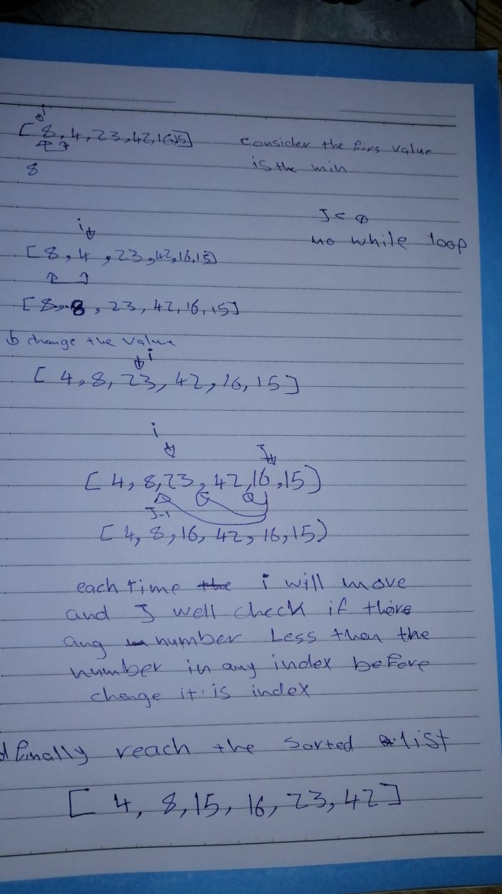

Challenge:
### In this challange I loop each time with `i` and git  `j` index befor it. if index `j` larger than the next index I compare the nex index in a revers way , and if there any index larger keep going back until I there is no number less than the index,, then replace them.
