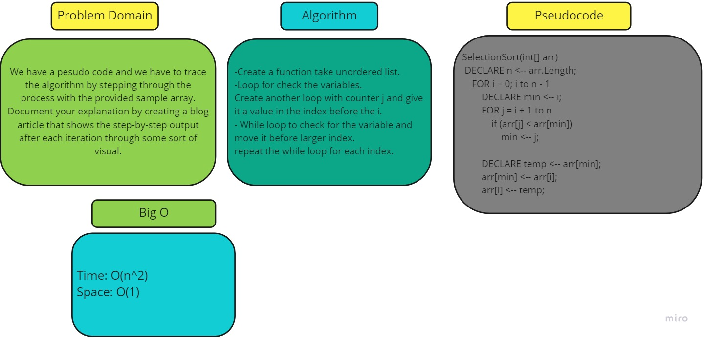

# Challenge Summary
<!-- Description of the challenge -->
We have a pesudo code and we have to trace the algorithm by stepping through the process with the provided sample array. Document your explanation by creating a blog article that shows the step-by-step output after each iteration through some sort of visual.
## Whiteboard Process
<!-- Embedded whiteboard image -->

## Approach & Efficiency
<!-- What approach did you take? Why? What is the Big O space/time for this approach? -->
Time: O(n^2)
Space: O(1)
## Solution
<!-- Show how to run your code, and examples of it in action -->
-Create a function take unordered list.
-Loop for check the variables.
Create another loop with counter j and give it a value in the index before the i.
- While loop to check for the variable and move it before larger index.
repeat the while loop for each index.