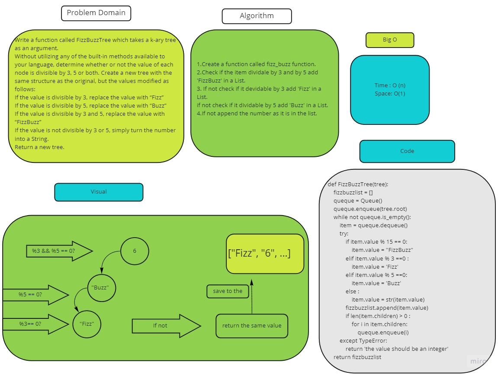

# Challenge Summary
<!-- Description of the challenge -->
Write a function called FizzBuzzTree which takes a k-ary tree as an argument.
Without utilizing any of the built-in methods available to your language, determine whether or not the value of each node is divisible by 3, 5 or both. Create a new tree with the same structure as the original, but the values modified as follows:
If the value is divisible by 3, replace the value with “Fizz”
If the value is divisible by 5, replace the value with “Buzz”
If the value is divisible by 3 and 5, replace the value with “FizzBuzz”
If the value is not divisible by 3 or 5, simply turn the number into a String.
Return a new tree.

## Whiteboard Process
<!-- Embedded whiteboard image -->

## Approach & Efficiency
<!-- What approach did you take? Why? What is the Big O space/time for this approach? -->
Big O:
Time : O(n)
Space : O(n)

## Solution
<!-- Show how to run your code, and examples of it in action -->
1.Create a function called fizz_buzz function.

2.Check if the item dividale by 3 and by 5 add  'FizzBuzz' in a List.

3. If not check if it devidable by 3 add 'Fizz' in a List.

if not check if it dividable by 5 add 'Buzz' in a List.

4.If not append the number as it is in the list.

