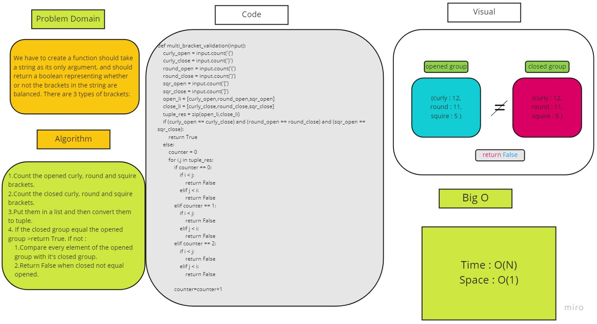

# Challenge Summary
<!-- Description of the challenge -->
We should create a function should take a string as its only argument, and should return a boolean representing whether or not the brackets in the string are balanced. There are 3 types of brackets:

Round Brackets : ()
Square Brackets : []
Curly Brackets : {}

## Whiteboard Process
<!-- Embedded whiteboard image -->

## Approach & Efficiency
<!-- What approach did you take? Why? What is the Big O space/time for this approach? -->
Time : o(n)
Space : O(1)
## Solution
<!-- Show how to run your code, and examples of it in action -->
1.Count the opened curly, round and squire brackets.

2.Count the closed curly, round and squire brackets.

3.Put them in a list and then convert them to tuple.

4. If the closed group equal the opened group >return True. if not :

 1.Compare every element of the opened  group with it's closed group.

 2.Return False when closed not equal

    opened.